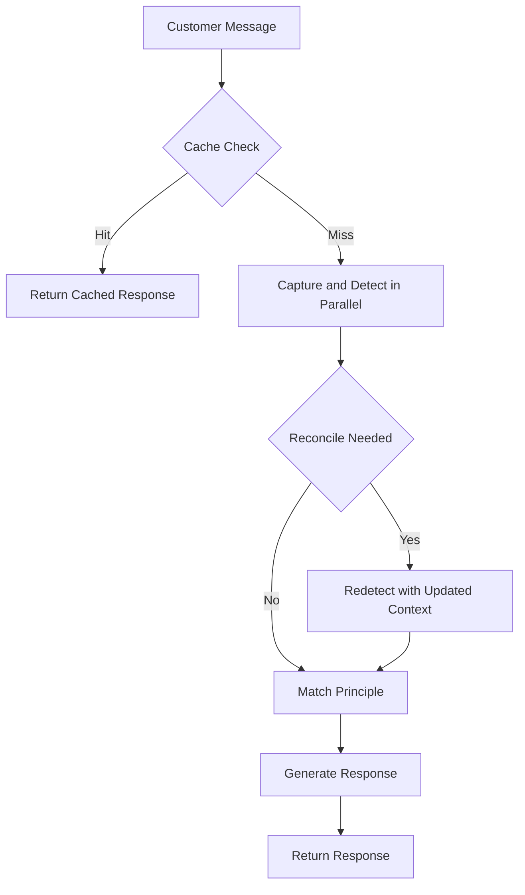
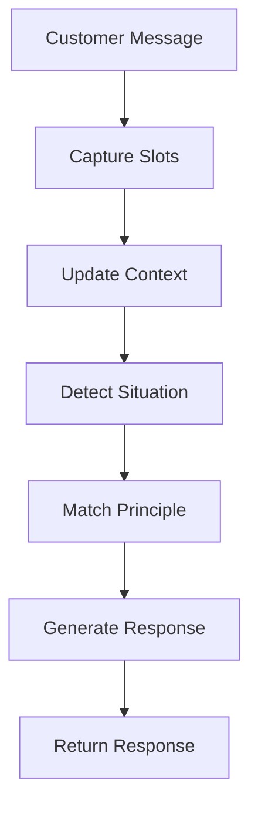
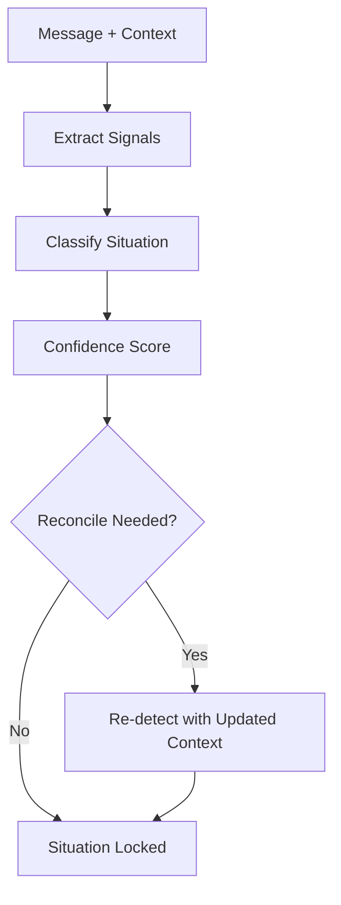
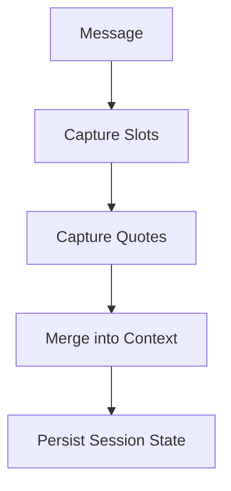
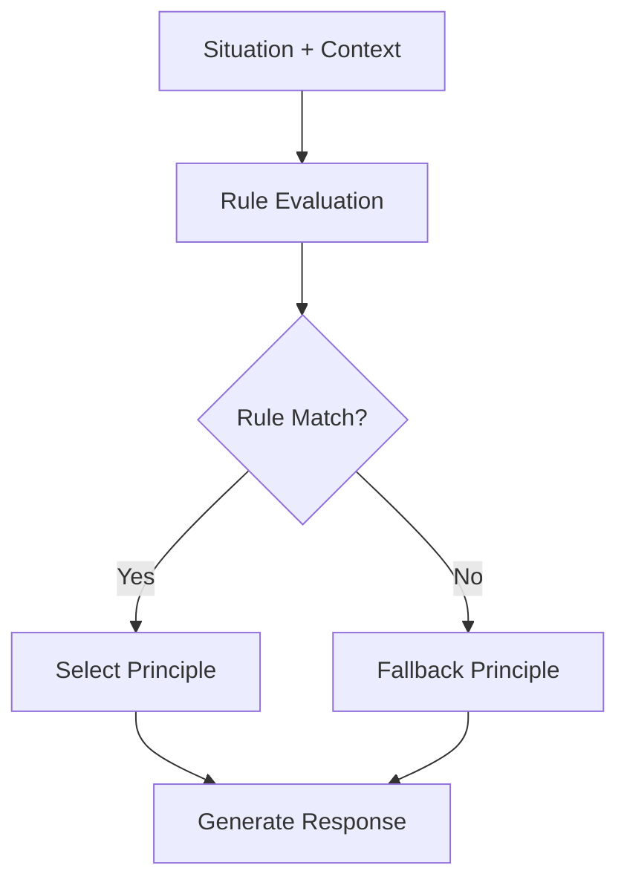
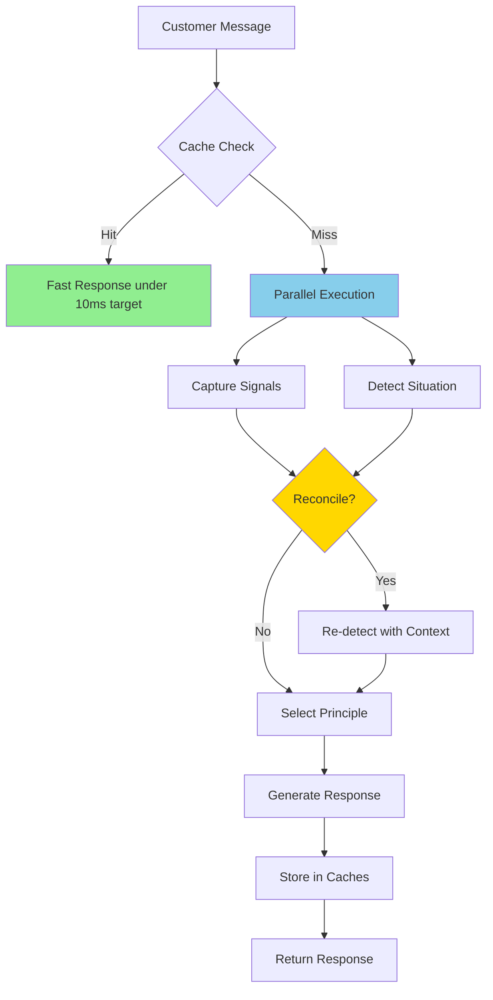
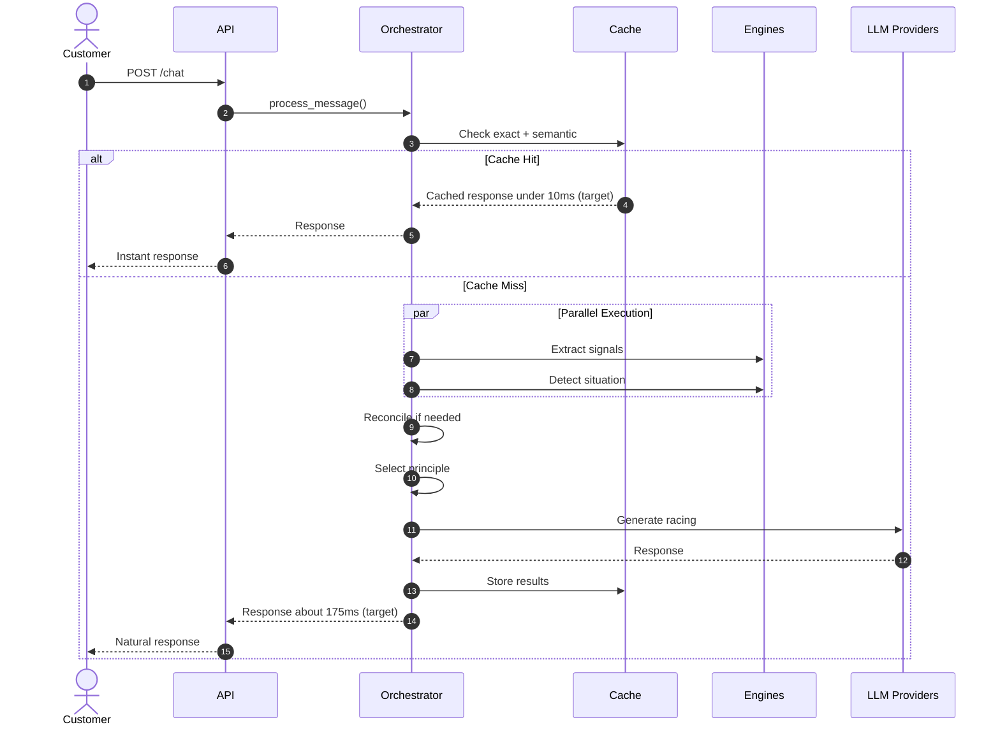

# 🚀 DealCloser - AI Sales Agent Engine

<div align="center">

[](LICENSE)


[](tests/)
[](tests/)
[](tests/unit/)
[](tests/)

[](https://anthropic.com)
[](https://openai.com)
[](https://docs.python.org/3/library/asyncio.html)
[](https://en.wikipedia.org/wiki/HTTP/2)


[Quick Start](#-quick-start) • [Features](#-features) • [Architecture](#-architecture) • [Testing](#-testing) • [Performance](#-performance) • [API](#-api-reference)

</div>

---

## 🧭 Simple Request Flow



## 🔍 Core Logic (Situation → Slots → Matching)

These diagrams describe the core decision engine: capture slots, detect situation, match principles, and generate responses. This is the heart of DealCloser.

### Core Logic Overview


### Situation Detection Path


### Slot Capture and Context Update


### Principle Matching


### Core Matching Logic (How Config Drives Decisions)

DealCloser is configuration-driven. The engine uses three inputs to decide the final response:

- **capture_schema.json**: Defines which slots to extract from messages (pain, budget_signal, objection, etc.). Captured slots and quotes update the session context.
- **situations.json**: Defines situations with signals and contra-signals. The detector scores situations against the current message + context and returns a winning situation and confidence.
- **principle_selector.json**: Defines rule-based mappings from situation + context to a principle. Rules are evaluated top-down, using `when_context_has` or `when_context_missing` to gate matches. If no rule matches, a fallback principle is used.

Simplified flow:
1. Capture slots from the message using `capture_schema.json`, then merge into session context.
2. Detect the most likely situation using `situations.json` signals and updated context.
3. Match a principle using `principle_selector.json` rules. If none match, use fallback.
4. Generate a response with the selected principle and the captured context.

## What is DealCloser?

DealCloser is a **production-ready AI sales agent engine** that transforms customer conversations into closing opportunities. It intelligently detects customer situations, selects proven sales principles from psychology research (Kahneman, Cialdini, Voss), and generates natural, human-like responses in milliseconds.


##  Quick Start

Get up and running in 3 minutes:

```bash
# 1. Install dependencies
pip install -r requirements.txt

# 2. Set up environment variables
cat > .env << EOF
ANTHROPIC_API_KEY=your_anthropic_key_here
OPENAI_API_KEY=your_openai_key_here  # Optional but recommended
EOF

# 3. Start the server
cd sales_agent
uvicorn api.main:app --reload

# 4. Test it out
curl -X POST http://localhost:8000/chat \
  -H "Content-Type: application/json" \
  -d '{
    "session_id": "demo-001",
    "message": "This product is too expensive",
    "product_context": {"name": "ErgoChair", "price": 899}
  }'
```

**🎉 That's it!** Your AI sales agent is now running at `http://localhost:8000`

>  **Pro Tip**: Adding `OPENAI_API_KEY` enables multi-provider racing (lower latency) and semantic caching (higher hit rates)

>  **New to DealCloser?** Check out the **[Detailed Setup Guide](SETUP.md)** for step-by-step instructions, troubleshooting, and how to run the Streamlit UI.

---

##  Table of Contents

- [Features](#-features)
- [Architecture](#-architecture)
- [Testing](#-testing)
- [API Reference](#-api-reference)
- [Performance](#-performance)
- [Configuration](#-configuration)
- [Development](#-development)

---

##  Features

###  Intelligent Situation Detection

Automatically detects customer situations (price objections, warranty concerns, comparison shopping, etc.) with high confidence scores.

###  Principle Selection Engine

Selects optimal sales principles based on:
- Detected situation
- Customer context (pain points, budget signals, emotional state)
- Conversation history (prevents repetition)
- Resistance tracking (adapts to customer pushback)

### Natural Response Generation

Generates human-like, empathetic responses that:
- Use customer's exact words (mirroring)
- Acknowledge concerns first
- Apply proven psychological principles
- Stay under 2 sentences (conversational)

### Performance Optimizations

| Optimization | Impact | Badge |
|-------------|--------|-------|
|  **Parallel Execution** | Target ~40% faster |  |
| **Two-Tier Caching** | Target <10ms hits |  |
| **Multi-Provider Racing** | Target ~30% faster |  |
| **Prompt Compression** | Target 50-60% tokens |  |
| **Connection Pooling** | Target reduced latency |  |
| **Tiered Model Routing** | Cost optimized |  |

### Smart Reconcile Logic

Automatically re-runs situation detection when:
- Initial confidence is low (<0.7)
- Critical context is captured (pain, objection, budget)
- Significant new information arrives

### Comprehensive Monitoring

- Cache hit rates (exact + semantic)
- Provider win rates (Anthropic vs OpenAI)
- Reconcile statistics
- Per-step latency breakdown
- Session state tracking

---

## Architecture

### System Flow



### Additional Flows

#### ⚡ Cache Hit Path


#### Cache Miss + Reconcile Path


#### LLM Fallback Path


### Core Components

```
🎯 Orchestrator (Brain)
├── 📊 Capture Engine (Extracts customer signals)
│   └── []()
├── 🎯 Situation Detector (Classifies customer situation)
│   └── []()
├── 🧠 Principle Selector (Selects best sales principle)
│   └── []()
├── 💬 Response Generator (Creates natural responses)
│   └── []()
└── 🏗️ Response Builder (Structures final output)

⚡ Performance Layer
├── 💾 ExactMatchCache (Exact duplicates)
│   └── []()
├── 🔍 SemanticCache (Similarity-based, embeddings)
│   └── []()
├── 🚀 LLMRouter (Multi-provider racing)
│   └── []()
└── 🔌 LLMConnectionPool (HTTP/2 pooling)
    └── []()
```

### Request Journey



---

## Testing

DealCloser comes with **comprehensive test coverage** ensuring reliability and maintainability.

###  Test Structure


| Path | Purpose | Test Count |
|------|---------|------------|
| `tests/conftest.py` | Shared fixtures and mocks | N/A |
| `tests/test_validation_suite.py` | Integration tests | 11 |
| `tests/unit/test_capture.py` | Capture engine tests | 20 |
| `tests/unit/test_situation_detector.py` | Situation detection tests | 21 |
| `tests/unit/test_principle_selector.py` | Principle selector tests | 27 |
| `tests/unit/test_response_builder.py` | Response builder tests | 28 |
| `tests/unit/test_response_generator.py` | Response generator tests | 22 |
| `tests/unit/test_exact_cache.py` | Exact cache tests | 26 |
| `tests/unit/test_semantic_cache.py` | Semantic cache tests | 31 |
| `tests/unit/test_llm_router.py` | LLM router tests | 24 |
| `tests/unit/test_llm_pool.py` | LLM pool tests | 14 |
| `tests/unit/test_orchestrator.py` | Orchestrator tests | 15 |
| `tests/unit/test_utils.py` | Utility tests | 12 |

###  Running Tests

[](tests/)

```bash
# Run all tests
pytest tests/ -v

# Run only unit tests
pytest tests/unit/ -v

# Run with coverage report
pytest tests/unit/ --cov=sales_agent/engine --cov-report=html --cov-report=term

# Run specific test file
pytest tests/unit/test_capture.py -v

# Run specific test
pytest tests/unit/test_principle_selector.py::TestRuleMatching::test_direct_situation_match -v

# Run with detailed output
pytest tests/unit/ -v -s

# Run fast tests only (skip slow ones)
pytest tests/unit/ -v -m "not slow"
```

###  Test Categories

| Category | Tests | Badge | Description |
|----------|-------|-------|-------------|
| **🔧 Pure Logic** | 94+ | []() | No external dependencies (cache, utils, selector, builder) |
| **🔌 Simple Mocks** | 65+ | []() | External APIs mocked (semantic cache, pool, generator) |
| **🔄 Complex Logic** | 45+ | []() | Multi-component interactions (router, orchestrator) |
| **🤖 LLM-Dependent** | 50+ | []() | LLM API interactions with mocks (capture, detector) |
| **🔗 Integration** | 11+ | []() | End-to-end API flow tests |

### What's Tested


- All engine modules (capture, detect, select, generate)
- All utility modules (caching, pooling, routing)
- All LLM interactions (with comprehensive mocking)
- Error handling and fallback logic
- Edge cases and boundary conditions
- Statistics and monitoring
- Session state management
- Reconcile logic
- Multi-provider racing
- Cache hit/miss scenarios

###  Quality Assurance

Every component is tested for:
- **Correctness**: Does it work as expected?
- **Reliability**: Does it handle errors gracefully?
- **Performance**: Are edge cases optimized?
- **Maintainability**: Are tests readable and isolated?

---

##  API Reference

###  POST /chat


Send a customer message and get an AI-generated sales response.

**Request:**
```json
{
  "session_id": "customer-123",
  "message": "This product is too expensive. My back has been hurting for years.",
  "product_context": {
    "name": "ErgoChair Pro",
    "price": 899,
    "category": "office furniture"
  }
}
```

**Response:**
```json
{
  "customer_facing": {
    "response": "I understand price is really important to you, and it sounds like your back has been hurting for years. What if this chair could help you avoid future back pain and medical costs?"
  },
  "agent_dashboard": {
    "detection": {
      "customer_said": "This product is too expensive. My back has been hurting for years.",
      "detected_situation": "price_shock_in_store",
      "situation_confidence": 0.92,
      "micro_stage": "objection_handling",
      "detected_persona": "price_conscious",
      "persona_confidence": 0.85
    },
    "captured_context": {
      "pain": "back pain",
      "duration": "years",
      "objection": "price"
    },
    "captured_quotes": [
      "too expensive",
      "back has been hurting for years"
    ],
    "qualification_checklist": {
      "need_identified": true,
      "pain_expressed": true,
      "product_interest": false,
      "budget_discussed": true,
      "timeline_known": false,
      "decision_maker_known": false
    },
    "recommendation": {
      "principle": "Loss Aversion",
      "principle_id": "kahneman_loss_aversion_01",
      "source": "Kahneman, Thinking Fast and Slow, Ch.26, p.284",
      "approach": "Frame in terms of what they'll lose",
      "response": "I understand price is really important to you, and it sounds like your back has been hurting for years. What if this chair could help you avoid future back pain and medical costs?",
      "why_it_works": "Loss framing increases motivation"
    },
    "fallback": {
      "principle": "Loss Aversion",
      "principle_id": "kahneman_loss_aversion_01",
      "response": "I understand you mentioned 'back has been hurting for years'. Can you tell me more about what you're looking for?"
    },
    "next_probe": {
      "target": "product_interest",
      "question": "What features are most important to you?"
    },
    "session": {
      "session_id": "customer-123",
      "turn_count": 1,
      "resistance_count": 0,
      "principles_used": ["kahneman_loss_aversion_01"]
    },
    "system": {
      "latency_ms": 156,
      "step_latencies": {
        "cache_ms": 0,
        "capture_ms": 45,
        "detect_ms": 52,
        "detect_parallel_ms": 48,
        "reconcile_ms": 4,
        "select_ms": 1,
        "generate_ms": 54,
        "reconcile_triggered": true
      }
    },
    "cache_hit": false,
    "cache_type": null
  }
}
```

### GET /session/{session_id}

Get the full session state including conversation history.

**Response:**
```json
{
  "captured_context": {
    "pain": "back pain",
    "duration": "years"
  },
  "captured_quotes": [
    "too expensive",
    "back has been hurting"
  ],
  "conversation_history": [
    {
      "customer": "This product is too expensive",
      "agent": "I understand price is important..."
    }
  ],
  "principle_history": [
    "kahneman_loss_aversion_01"
  ],
  "resistance_count": 0
}
```

###  DELETE /session/{session_id}

Clear a session's state.

**Response:**
```json
{
  "status": "cleared"
}
```

### GET /cache/stats


Get cache statistics (exact + semantic).

**Response:**
```json
{
  "exact_cache": {
    "hits": 1250,
    "misses": 3750,
    "hit_rate": 0.25,
    "size": 892,
    "max_size": 1000,
    "ttl_seconds": 3600
  },
  "semantic_cache": {
    "hits": 210,
    "misses": 990,
    "hit_rate": 0.175,
    "embedding_computations": 1200,
    "size": 756,
    "max_size": 1000,
    "ttl_seconds": 3600,
    "similarity_threshold": 0.92,
    "enabled": true
  },
  "combined": {
    "exact_hits": 1250,
    "semantic_hits": 210,
    "exact_misses": 3750,
    "semantic_misses": 990,
    "total_hits": 1460,
    "total_requests": 5000
  }
}
```

### GET /reconcile/stats

Get reconcile statistics (how often parallel execution needs reconciliation).

**Response:**
```json
{
  "total_requests": 5000,
  "reconciles": 850,
  "reconcile_rate": 0.17
}
```

###  GET /llm/stats

Get LLM provider statistics (win rates, error rates for racing).

**Response:**
```json
{
  "anthropic": {
    "wins": 2850,
    "errors": 12,
    "total": 2862,
    "win_rate": 0.9958,
    "error_rate": 0.0042
  },
  "openai": {
    "wins": 2138,
    "errors": 8,
    "total": 2146,
    "win_rate": 0.9963,
    "error_rate": 0.0037
  }
}
```

### ❤️ GET /health

[]()
[]()

Health check endpoint with system status.

**Response:**
```json
{
  "status": "ok",
  "llm_connection": "ok",
  "config_loaded": true,
  "api_key_present": true
}
```

### 📍 GET /

[]()
[]()

Root endpoint with API information.

**Response:**
```json
{
  "message": "Sales Agent API",
  "endpoints": {
    "chat": "POST /chat",
    "get_session": "GET /session/{session_id}",
    "clear_session": "DELETE /session/{session_id}",
    "health": "GET /health"
  }
}
```

---

## Configuration

###  Configuration Files


Customize DealCloser by editing JSON files in `sales_agent/config/`:

| File | Purpose | Badge | Key Fields |
|------|---------|-------|------------|
| `principles.json` | Sales principles | []() | `principle_id`, `name`, `intervention`, `mechanism` |
| `situations.json` | Customer situations | []() | `signals`, `stage`, `description` |
| `principle_selector.json` | Selection rules | []() | `rules`, `fallback`, `when_context_has` |
| `capture_schema.json` | Extraction schema | []() | `slots`, `priority`, `listen_for` |
| `settings.py` | Environment config | []() | API keys, cache, retry, LLM configs |

### 🔧 Environment Variables

[]()
[]()
[]()

```bash
# Required
ANTHROPIC_API_KEY=sk-ant-...

# Optional (enables racing + semantic cache)
OPENAI_API_KEY=sk-...

# Optional - Cache Configuration
CACHE_TTL_SECONDS=3600              # Default: 3600 (1 hour)
CACHE_MAX_SIZE=1000                 # Default: 1000
SEMANTIC_CACHE_SIMILARITY_THRESHOLD=0.92  # Default: 0.92

# Optional - Retry Configuration
RETRY_MAX_ATTEMPTS=3                # Default: 3
RETRY_BASE_DELAY_SECONDS=1.0        # Default: 1.0
RETRY_MAX_DELAY_SECONDS=10.0        # Default: 10.0

# Optional - LLM Configuration
LLM_TIMEOUT_SECONDS=30.0            # Default: 30.0
LLM_MAX_TOKENS_CAPTURE=500          # Default: 500
LLM_MAX_TOKENS_SITUATION=200        # Default: 200
LLM_MAX_TOKENS_RESPONSE=150         # Default: 150

# Optional - Connection Pool Configuration
HTTP_MAX_KEEPALIVE_CONNECTIONS=10   # Default: 10
HTTP_MAX_CONNECTIONS=20             # Default: 20

# Optional - Model Configuration
ANTHROPIC_MODEL=claude-sonnet-4-20250514
ANTHROPIC_MODEL_FAST=claude-sonnet-4-20250514
OPENAI_MODEL=gpt-4o
OPENAI_MODEL_FAST=gpt-4o-mini
OPENAI_EMBEDDING_MODEL=text-embedding-3-small

# Optional - Orchestrator Configuration
RECONCILE_CONFIDENCE_THRESHOLD=0.7  # Default: 0.7
RECONCILE_NEW_SLOTS_THRESHOLD=3     # Default: 3
RECONCILE_NEW_QUOTES_THRESHOLD=1    # Default: 1

# Optional - Logging
LOG_LEVEL=INFO                       # Default: INFO (DEBUG, INFO, WARNING, ERROR)
```

###  Settings Management


Configuration is managed centrally via `sales_agent/config/settings.py`:

```python
from config.settings import config

# Access configuration
api_key = config.ANTHROPIC_API_KEY
cache_ttl = config.CACHE_TTL_SECONDS
log_level = config.LOG_LEVEL

# Validate required config
config.validate()  # Raises ValueError if ANTHROPIC_API_KEY missing

# Check if OpenAI enabled
if config.is_openai_enabled():
    # Use OpenAI features
    pass
```

---

## Development

### 📁 Project Structure


```
dealcloser/
├── sales_agent/
│   ├── api/
│   │   └── main.py              # FastAPI application
│   │       └── []()
│   ├── config/
│   │   ├── principles.json      # Sales principles
│   │   │   └── []()
│   │   ├── situations.json      # Customer situations
│   │   │   └── []()
│   │   ├── principle_selector.json
│   │   │   └── []()
│   │   ├── capture_schema.json
│   │   │   └── []()
│   │   └── settings.py          # Environment config
│   │       └── []()
│   └── engine/
│       ├── orchestrator.py      # Main orchestration logic
│       ├── capture.py           # Signal extraction
│       ├── situation_detector.py
│       ├── principle_selector.py
│       ├── response_generator.py
│       ├── response_builder.py
│       ├── exact_cache.py       # Exact-match caching
│       ├── semantic_cache.py    # Similarity-based caching
│       ├── llm_router.py        # Multi-provider racing
│       ├── llm_pool.py          # Connection pooling
│       └── utils.py             # Retry logic, helpers
├── tests/
│   ├── conftest.py              # Shared test fixtures
│   │   └── []()
│   ├── test_validation_suite.py # Integration tests
│   │   └── []()
│   └── unit/                    # 240+ unit tests
│       └── []()
├── requirements.txt
│   └── []()
└── README.md
```

### Development Setup

[]()


```bash
# Clone and install
git clone <repo-url>
cd DealCloser
pip install -r requirements.txt

# Install dev dependencies (already in requirements.txt)
# pytest pytest-asyncio pytest-mock pytest-cov pytest-timeout

# Run tests
pytest tests/ -v

# Run with coverage
pytest tests/unit/ --cov=sales_agent/engine --cov-report=html

# Start FastAPI server (Terminal 1)
cd sales_agent
uvicorn api.main:app --reload

# Start Streamlit UI (Terminal 2 - in project root)
cd /path/to/DealCloser
streamlit run streamlit_app.py
```

>  **For detailed setup instructions, see [SETUP.md](SETUP.md)**

###  Code Quality


- **Linting**: Follow PEP 8 style guide
- **Type Hints**: Use type annotations
- **Docstrings**: Document all public functions
- **Tests**: Write tests for new features
- **Coverage**: Target 90%+ coverage

###  Config Details

- **capture_schema.json**: `version: 1.0`, `domain: retail_b2c`, **23 slots**
- **principle_selector.json**: `version: 1.0`, `domain: retail`, **27 rules**
- **principles.json**: **75+ principles** from Kahneman, Cialdini, Voss
- **situations.json**: **50+ situations** with signals and stages

---

<div align="center">

**Built with ❤️ for closing more deals**

[](https://github.com/yourusername/dealcloser)
[](https://github.com/yourusername/dealcloser/issues)
[](https://github.com/yourusername/dealcloser/issues)

</div>
